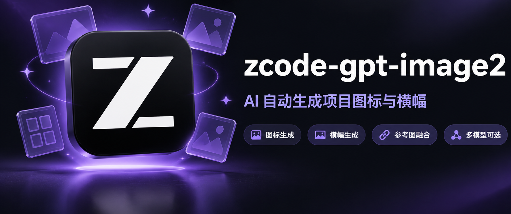

# zcode-gpt-image2



一个 ZCode Skill：项目开发完成后，AI 自动提取项目特征、编写生图提示词，调用 OpenAI
**gpt-image-2** 接口，生成风格匹配的**软件图标**、**GitHub 仓库横幅（social preview）**
和 **README 配图**——你只需要说"给这个项目生成横幅"，不用写任何生图 prompt。

## 特性

- **零门槛**：API Key 在对话里发给 AI 一次，自动写入本地配置文件，不碰环境变量
- **智能默认**：项目名/简介/技术栈自动从 `package.json` / `pyproject.toml` / `README.md`
  提取，配色按技术栈风格表匹配，能不问就不问
- **参考图融合**：生成前 AI 会问是否融合参考图——可以联网搜索品牌图标（ZCode、Claude、
  Codex 等官方 logo），也可以用你提供的图片，通过 `images/edits` 端点把风格融进横幅
- **模型可选**：`--list-models` 列出中转站全部生图模型（gpt-image-2 系列、2.5-flare、
  gemini、seedream 等），生成前让你选
- **分辨率档位**：`--res 1k/2k/4k` 自动映射中转站的分档模型（如 `gpt-image-2-2k`），
  没有分档的端点自动退回标准模型 + 显式尺寸；`--ratio` 支持任意比例（16:9、9:16…）
- **透明背景**：渠道不支持透明参数时自动用 Pillow 从边缘泛洪抠图，图标输出真透明 RGBA
- **通用性**：按标准 OpenAI Images API 编写，最简请求体 + 400 自动降级 + 浏览器 UA +
  代理支持，不绑定任何一家中转站

## 安装

```bash
# 全局生效（所有项目可用）
cp -r project-visual-generator ~/.agents/skills/

# 或只在某个项目生效
cp -r project-visual-generator <项目>/.agents/skills/
```

## 配置（小白友好）

**方式一（推荐）**：装好 skill 后直接对 ZCode 说"生成图标"，没配 Key 时 AI 会向你要
Key 和接口地址，自动写入 `~/.zcode/project-visual-generator.json`。

**方式二**：终端运行 `python project-visual-generator/scripts/generate_assets.py --setup`

**方式三**：环境变量 `OPENAI_API_KEY` + `OPENAI_BASE_URL`（服务器/CI 场景）。

优先级：命令行参数 > 环境变量 > 配置文件。请勿把 Key 提交到任何仓库。

## 使用

对 ZCode 说：

> 给这个项目生成横幅
> 做个 logo，要 2K 的
> 融合 ZCode 的图标风格，生成图标和横幅

或直接命令行调用：

```bash
python project-visual-generator/scripts/generate_assets.py \
  --name "MyProject" --desc "AI powered code reviewer" \
  --tech "Python AI CLI" --color "#8b5cf6" \
  --assets icon,banner --out ./docs/assets \
  --update-readme
```

常用参数：

| 参数 | 说明 |
|---|---|
| `--assets icon,banner,illustration` | 要生成的资产（默认 icon,banner） |
| `--ref-images a.png,b.png` | 参考图，走 `images/edits` 融合风格 |
| `--list-models` | 列出端点可用的生图模型 |
| `--model gpt-image-2.5-flare` | 指定生图模型 |
| `--res 1k/2k/4k` | 分辨率档位（自动映射分档模型） |
| `--ratio 16:9` | 自定义画幅比例（最大 3:1） |
| `--icon-sizes 16,32,...` | 多尺寸图标导出（需 Pillow） |
| `--update-readme` | 自动把横幅和图标插入 README |
| `--dry-run` | 只打印提示词不调用接口 |

## 资产规格

| 资产 | 默认尺寸 | 说明 |
|---|---|---|
| icon | 1024x1024 透明底 | 渠道不支持透明时自动本地抠图 |
| banner | 1280x640 | GitHub social preview 的 2:1 规格，直接生成无需裁剪 |
| illustration | 1200x624 | README 配图，宽高为 16 的倍数（gpt-image-2 约束） |

`--res` 档位对应长边 1024/2048/4096，超出 gpt-image-2 官方像素上限（65.5 万 ~ 830 万）
时自动钳制（如 4K 方图 → 2880x2880）。

## 致谢

参考图融合与分辨率分档的适配过程中的排查思路，受益于社区同类项目
[GPT-Image2-Skill](https://github.com/wuyoscar/GPT-Image2-Skill) 与
[claude-gpt-image-bridge](https://github.com/oakplank/claude-gpt-image-bridge)。
